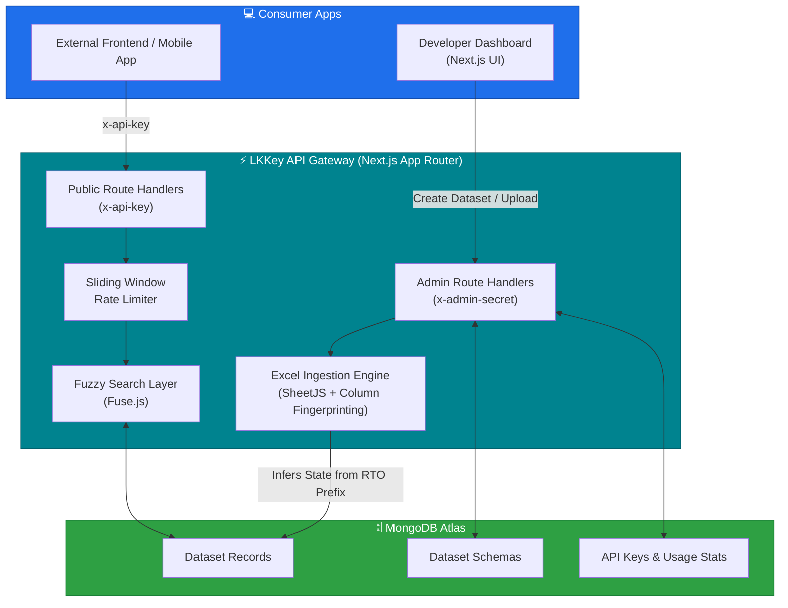
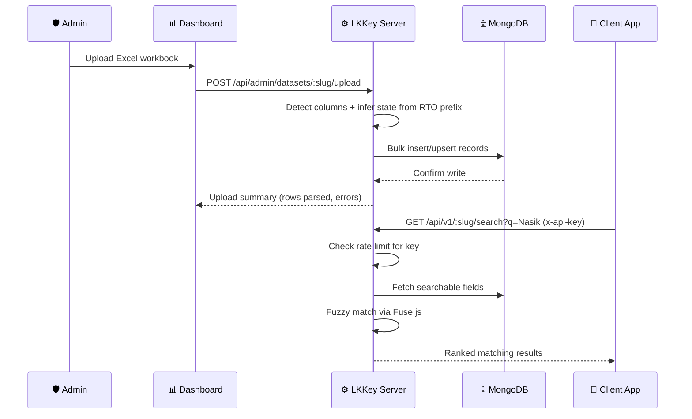
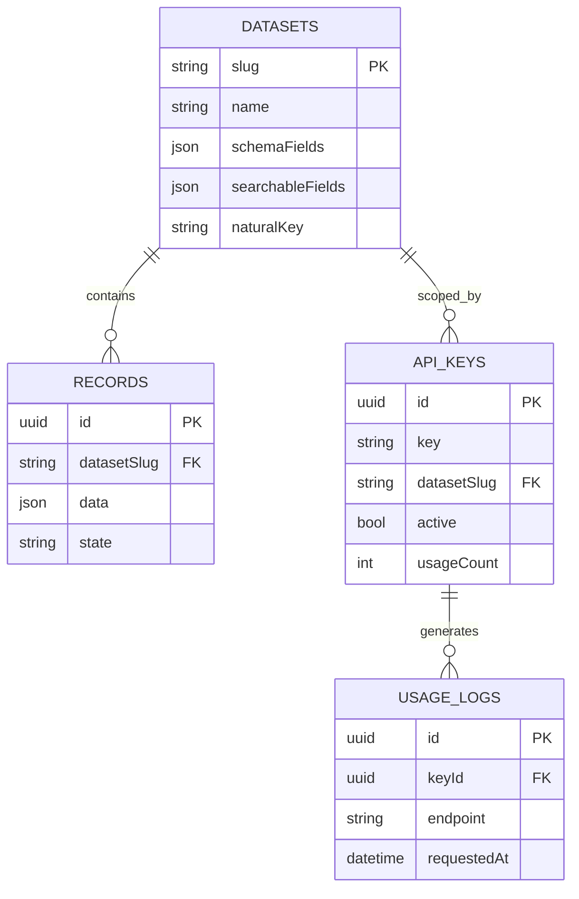

<div align="center">


<br/>

[](https://www.mongodb.com/atlas)
[](#-license)
[](#)

<br/>

[](https://github.com/AmanMahadik/LKKey)
[](https://github.com/AmanMahadik/LKKey/commits)
[](https://github.com/AmanMahadik/LKKey/stargazers)
[](https://github.com/AmanMahadik/LKKey/network/members)
[](https://github.com/AmanMahadik/LKKey/issues)

### 🔑 A generic, reusable **lookup data API gateway** that turns any Excel sheet into a fast, fuzzy-searchable, production-ready REST API — **in minutes, not days.**

#### 🌐 Live Deployment
* 🚀 **Developer Dashboard & API:** [https://lk-key.vercel.app/](https://lk-key.vercel.app/)

</div>

<br/>

<div align="center">

### 🛠️ Built With


<br/><br/>

**Next.js 16 (App Router)** &nbsp;•&nbsp; **TypeScript** &nbsp;•&nbsp; **MongoDB Atlas + Mongoose** &nbsp;•&nbsp; **SheetJS (xlsx)** &nbsp;•&nbsp; **Fuse.js**

</div>

<br/>

---

## 🚦 Get Started

<div align="center">

### 👉 [**🔗 Open the Live Dashboard**](https://lk-key.vercel.app/) 👈

Head to the link above to explore the developer dashboard, define datasets, upload Excel sheets, and generate your own API keys — no local setup required.

</div>

---

## 📚 Table of Contents

- [About the Project](#-about-the-project)
- [Key Features](#-key-features)
- [Quick Start Guide](#-quick-start-guide)
- [System Architecture](#%EF%B8%8F-system-architecture)
- [Tech Stack](#-tech-stack)
- [Security Model](#-security-model)
- [Database Schema](#%EF%B8%8F-database-schema)
- [Project Structure](#-project-directory-structure)
- [Environment Setup](#%EF%B8%8F-environment-configuration)
- [Running Locally](#-running-the-project-locally)
- [Deployment Guide](#%EF%B8%8F-deployment-guide)
- [API Reference](#-api-reference)
- [Contributing](#-contributing)
- [License](#-license)
- [Author](#-author)

---

## 🌱 About the Project

**LKKey** is a standalone, reusable lookup data microservice and API gateway built with **Next.js (App Router, TypeScript)**. It lets developers and administrators upload raw Excel datasets — RTO codes, pincodes, ISD codes, IFSC codes, GST registries, and more — automatically parses the columns, and exposes high-performance public REST endpoints protected by custom API keys.

> 💡 *Drop in an Excel sheet. Get a fuzzy-searchable, rate-limited, production API back. No schema migrations, no redeploys.*

It ships with a premium, Vercel/CRED-inspired dark developer dashboard styled with vanilla CSS, so managing datasets and keys never feels like reading raw JSON.

---

## ✨ Key Features

<table>
<tr>
<td width="50%" valign="top">

### ⚙️ Generic Dataset Engine
Reuse the same microservice for any tabular dataset — no code changes required for new tables. Define a schema once from the dashboard and start uploading.

### 🧠 Smart Column Detection
Automatically detects column indices for fields like `city` and `rto_code` on Excel uploads that don't contain header rows, by scanning data cell fingerprints.

### 🗺️ State Prefix Inference
Automatically infers the Indian State field (e.g. `state: "Maharashtra"`) by analyzing RTO code prefixes (e.g. `MH`), making uploads even simpler.

</td>
<td width="50%" valign="top">

### 🔍 Server-Side Fuzzy Search
Fast, typo-tolerant lookups powered by `fuse.js` across configured searchable fields — so `q=Nasik` still finds `Nashik`.

### 🔐 Token-Based Security
Administrative endpoints are protected by an `ADMIN_SECRET` header, while public queries require client `x-api-key` headers.

### 🚦 Rate Limiting & CORS Ready
In-memory sliding window rate limits (100 req/min for search/lookups, 10 req/min for full scans) per client key, plus preflight CORS handlers so any frontend can consume the API directly.

</td>
</tr>
</table>

<div align="center">

```
🔑 ──────────────────────────────────────────── 🔑
   One Excel Sheet   →   One Production-Ready API
🔑 ──────────────────────────────────────────── 🔑
```

</div>

---

## 🏁 Quick Start Guide

Get your search API up and running in 4 easy steps — right from the [live dashboard](https://lk-key.vercel.app/):

<div align="center">

| Step | Action | Details |
|:---:|:---|:---|
| **01 🛡️** | **Save Admin Secret** | Go to **Settings** and save the admin secret (default: `amanadminsecret123`) to authorize writes. |
| **02 🗄️** | **Define Dataset** | Go to **Datasets**, click **Create**, and define your schema fields, searchable parameters, and natural keys. |
| **03 ⬆️** | **Upload Excel** | Drop your sheet in **Uploads**. The smart parser maps cities and auto-infers states from RTO prefixes (e.g. `MH`). |
| **04 🔑** | **Query the API** | Generate a key in **API Keys** and start sending fuzzy requests (e.g. `/search?q=Nasik`) in your apps! |

</div>

> ⚠️ **Security note:** Change the default admin secret (`amanadminsecret123`) before using this in any real deployment — it should never be left as-is in production.

---

## 🏗️ System Architecture



### 🔄 Excel Upload → Public Query Flow



---

## 🧱 Tech Stack

| Layer | Technology | Purpose |
|:---|:---|:---|
| **Framework** | `Next.js 16 (App Router)` | Unified dashboard UI + serverless API routes |
| **Language** | `TypeScript` | End-to-end type safety |
| **Database** | `MongoDB Atlas + Mongoose` | Flexible, schema-per-dataset document storage |
| **Excel Engine** | `SheetJS (xlsx)` | Parses uploaded workbooks into structured records |
| **Fuzzy Matching** | `Fuse.js` | Typo-tolerant server-side search |
| **Icons** | `lucide-react` | Dashboard iconography |
| **Styling** | `Vanilla CSS` | Vercel/CRED-inspired dark developer dashboard |

---

## 🔐 Security Model

<div align="center">

| Endpoint Type | Required Header | Access |
|:---|:---:|:---|
| Admin (`/api/admin/*`) | `x-admin-secret` | Create/manage datasets, upload Excel sheets, issue & revoke API keys |
| Public (`/api/v1/*`) | `x-api-key` | Search, lookup, and paginate dataset records |

</div>

> 🔐 **Auto-seeding** runs strictly when no datasets exist, preventing any accidental data loss or overwrite of previously uploaded records during restarts or redeploys.

---

## 🗄️ Database Schema



---

## 📂 Project Directory Structure

```text
lkkey/
├── app/
│   ├── (dashboard)/                 # Developer dashboard UI (Settings, Datasets, Uploads, API Keys)
│   └── api/
│       ├── admin/                     # Admin route handlers (datasets, uploads, api-keys)
│       └── v1/                        # Public route handlers (search, lookup, all)
│
├── lib/
│   ├── db.ts                        # MongoDB / Mongoose connection
│   ├── parser/                      # Excel ingestion + column fingerprinting + RTO state inference
│   ├── search/                      # Fuse.js fuzzy search config
│   └── rateLimit.ts                 # Sliding window rate limiter
│
├── models/                          # Mongoose schemas (Dataset, Record, ApiKey)
│
└── .env.example
```

---

## ⚙️ Environment Configuration

<details>
<summary><b>🔧 App Environment (<code>.env</code>)</b> — click to expand</summary>

<br/>

Create a `.env` file in the project root with the following variables:

```env
MONGODB_URI=your_mongodb_connection_string
ADMIN_SECRET=your_secure_admin_secret_here
PORT=3000
```

</details>

<details>
<summary><b>🗄️ MongoDB Atlas Setup</b> — click to expand</summary>

<br/>

1. Create a free cluster at [mongodb.com/atlas](https://www.mongodb.com/atlas).
2. Whitelist your IP (or `0.0.0.0/0` for development).
3. Copy your connection string into `MONGODB_URI`.
4. Choose a strong, unique value for `ADMIN_SECRET` — don't ship the default.

</details>

---

## 💻 Running the Project Locally

**1️⃣ Clone the Repository**

```bash
git clone https://github.com/AmanMahadik/LKKey.git
cd LKKey
```

**2️⃣ Install Dependencies**

```bash
npm install
```

**3️⃣ Configure Environment**

```bash
cp .env.example .env
# fill in your MongoDB URI & admin secret
```

**4️⃣ Run Development Server**

```bash
npm run dev
```

Open [http://localhost:3000](http://localhost:3000) to view the developer dashboard.

**5️⃣ Build for Production**

```bash
npm run build
npm run start
```

---

## ☁️ Deployment Guide

LKKey is designed to run as a single deployable serverless or containerized service.

### 1. Deploying to Vercel (Serverless)
Next.js integrates natively with Vercel — this is how the [live deployment](https://lk-key.vercel.app/) is hosted:
1. Push your code to GitHub.
2. Import the repository into the **Vercel Dashboard**.
3. Add the following **Environment Variables**:
   - `MONGODB_URI`
   - `ADMIN_SECRET`
4. Click **Deploy**. Vercel will build the dashboard and serve the Route Handlers as Serverless Functions automatically.

### 2. Deploying to Railway / Render (Docker/Node container)
Railway and Render automatically detect Next.js and run the server using `npm run start`:
1. Create a new service and connect your repository.
2. In the service settings, add the environment variables:
   - `MONGODB_URI`
   - `ADMIN_SECRET`
   - `PORT` (Railway/Render will bind this automatically at runtime).
3. The server will start, exposing the dashboard and API routes under a persistent host.

---

## 📡 API Reference

All requests must contain headers:
*   Admin endpoints: `x-admin-secret: <your_admin_secret>`
*   Public endpoints: `x-api-key: <client_api_key>`

<div align="center">

### 🛡️ Admin Endpoints

| Method | Endpoint | Description |
|:---:|:---|:---|
| `POST` | `/api/admin/datasets` | Create a new dataset definition schema |
| `GET` | `/api/admin/datasets` | List dataset schemas |
| `POST` | `/api/admin/datasets/:slug/upload` | Upload Excel workbook (`file` param, multipart form data) |
| `POST` | `/api/admin/api-keys` | Generate a new API key |
| `GET` | `/api/admin/api-keys` | List generated API keys and usage statistics |
| `PATCH` | `/api/admin/api-keys/:id/revoke` | Revoke (deactivate) an API key |
| `GET` | `/api/admin/health` | Check database status and count statistics |

### 🌍 Public Endpoints

| Method | Endpoint | Description |
|:---:|:---|:---|
| `GET` | `/api/v1/:datasetSlug/search?q=query` | Fuzzy search across searchable fields (e.g., typos like `q=Nasik`) |
| `GET` | `/api/v1/:datasetSlug/lookup?city=Nashik` | Exact/filtered lookup |
| `GET` | `/api/v1/:datasetSlug/all?page=1&limit=20` | Retrieve paginated full dataset |

</div>

---

## 🤝 Contributing

Contributions, forks, and pull requests are welcome! 🎉

```bash
# 1. Fork the repo
# 2. Clone your fork
git clone https://github.com/AmanMahadik/LKKey.git

# 3. Create your feature branch
git checkout -b feature/amazing-feature

# 4. Commit your changes
git commit -m "Add some amazing feature"

# 5. Push to the branch
git push origin feature/amazing-feature

# 6. Open a Pull Request 🚀
```

Found a bug or have an idea? [Open an issue](../../issues) — every contribution helps make lookup data a little less painful for the next developer who needs it.

---

## 📄 License

This project is **Proprietary**. All rights reserved. Redistribution, modification, or commercial use requires explicit prior permission from the author.

> 📌 *Swap this section for your actual license (MIT, CC BY-NC 4.0, etc.) if you intend to open-source the project.*

---

## 👤 Author

<div align="center">

**Aman Mahadik**

[](https://github.com/AmanMahadik)

<br/>

### ⭐ If LKKey saved you from building yet another lookup API from scratch, consider giving it a star!


</div>
